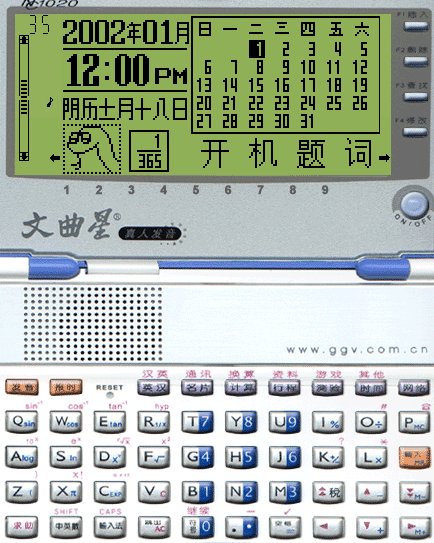

# js版文曲星nc1020模拟器
## [网页版文曲星nc1020模拟器](https://leoncoolmoon.github.io/jswqx1020/)  

从 https://dnbwg.cdn.bcebos.com/jswqx/index.html 基础上修改增加了图形界面 
 
orginal: http://bbs.emsky.net/viewthread.php?tid=33474 
目前只在chrome浏览器测试过，别的浏览器应该也有能跑的。 
由于ROM文件有24M之大，若加载过慢，请自行下载到硬盘上，拖拽到模拟器的屏幕区域手动加载。 
若想要离线使用能正常加载，请在chrome启动参数中加入`--allow-file-access-from-files`。 
2018.09.11 Dr.Quest优化版，压缩ROM到10M ZIP文件，添加了手机触摸屏支持 
2023.12.24 leoncoolmoon 修改了UI 
